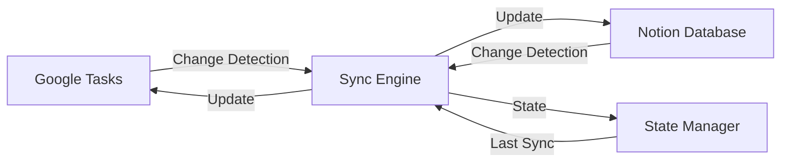

# Google Tasks ↔️ Notion Bidirectional Sync - Technical Specification

## 1. Overview

This document specifies a bidirectional synchronization system between Google Tasks and Notion databases using their respective APIs. The system is built with Node.js and ES6+ JavaScript syntax, featuring automatic, real-time synchronization that allows updates on either platform to be reflected on the other.

## 2. System Architecture

### 2.1 Components

- **Sync Engine:** Core bidirectional synchronization logic
- **Google Tasks Service:** API client for Google Tasks operations
- **Notion Service:** API client for Notion database operations
- **Conflict Resolution Module:** Handles simultaneous updates on both platforms
- **State Manager:** Tracks sync state and prevents duplicate operations
- **Webhook Server:** Receives real-time notifications (where available)
- **Scheduler:** Polling mechanism for platforms without webhooks

### 2.2 Data Flow



## 3. Technical Requirements

### 3.1 Dependencies

```json
{
  "dependencies": {
    "@notionhq/client": "^2.2.15",
    "googleapis": "^128.0.0",
    "express": "^4.18.2",
    "dotenv": "^16.3.1",
    "node-cron": "^3.0.3",
    "sqlite3": "^5.1.7",
    "winston": "^3.11.0",
    "axios": "^1.6.2"
  }
}
```

### 3.2 Environment Variables

```bash
## Google Tasks API
GOOGLE_CLIENT_ID=your_client_id
GOOGLE_CLIENT_SECRET=your_client_secret
OAUTH_REDIRECT_URI=http://localhost:3000/oauth2callback

## Notion API
NOTION_API_KEY=your_notion_integration_token
NOTION_DATABASE_ID=your_database_id

## Application
PORT=3000
SYNC_INTERVAL_MINUTES=5
LOG_LEVEL=info
STATE_DB_PATH=./sync_state.db
```

## 4. Data Models

### 4.1 Task Object Structure

```jsx
class Task {
  constructor({
    id,
    title,
    description = '',
    status = 'needsAction', // 'needsAction' | 'completed'
    due = null,
    notes = '',
    parent = null,
    position = null,
    links = [],
    lastModified,
    sourceSystem, // 'google' | 'notion'
    googleTaskId = null,
    notionPageId = null,
    taskListId = null
  }) {
    this.id = id;
    this.title = title;
    this.description = description;
    this.status = status;
    this.due = due;
    this.notes = notes;
    this.parent = parent;
    this.position = position;
    this.links = links;
    this.lastModified = lastModified;
    this.sourceSystem = sourceSystem;
    this.googleTaskId = googleTaskId;
    this.notionPageId = notionPageId;
    this.taskListId = taskListId;
  }
}
```

### 4.2 Sync State Schema

```sql
CREATE TABLE IF NOT EXISTS sync_state (
  id INTEGER PRIMARY KEY AUTOINCREMENT,
  google_task_id TEXT UNIQUE,
  notion_page_id TEXT UNIQUE,
  task_list_id TEXT,
  last_synced_at DATETIME,
  google_last_modified DATETIME,
  notion_last_modified DATETIME,
  sync_hash TEXT,
  created_at DATETIME DEFAULT CURRENT_TIMESTAMP,
  updated_at DATETIME DEFAULT CURRENT_TIMESTAMP
);

CREATE INDEX idx_google_task_id ON sync_state(google_task_id);
CREATE INDEX idx_notion_page_id ON sync_state(notion_page_id);
```

### 4.3 Notion Database Properties

```jsx
const NOTION_PROPERTIES = {
  Title: { type: 'title' },
  Status: { 
    type: 'select',
    options: ['To Do', 'In Progress', 'Done']
  },
  'Due Date': { type: 'date' },
  Description: { type: 'rich_text' },
  Notes: { type: 'rich_text' },
  'Google Task ID': { type: 'rich_text' },
  'Task List': { type: 'select' },
  'Last Synced': { type: 'date' }
};
```

## 5. Core Services

### 5.1 Google Tasks Service

```jsx
// services/googleTasksService.js
import { google } from 'googleapis';
import { authenticate } from '../auth/googleAuth.js';

class GoogleTasksService {
  constructor() {
    this.auth = null;
    this.tasks = null
```